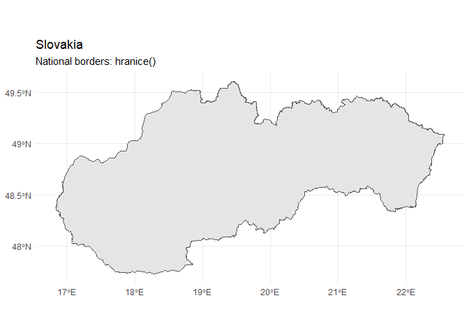
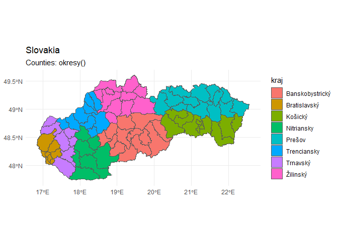
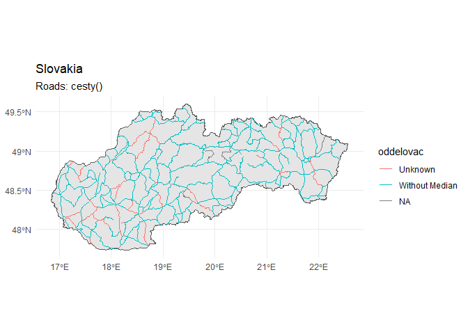
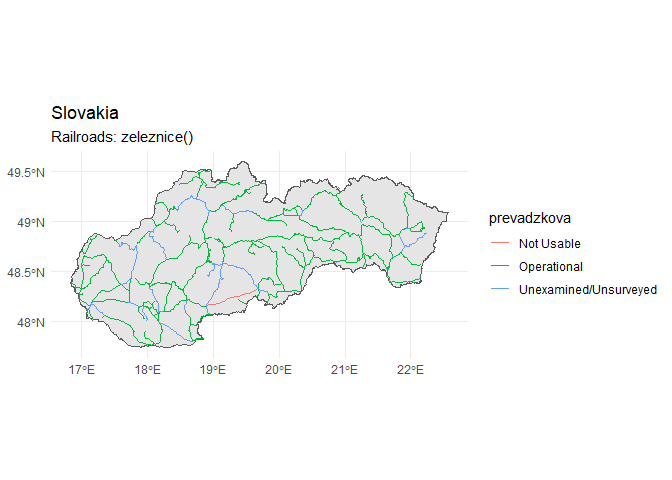
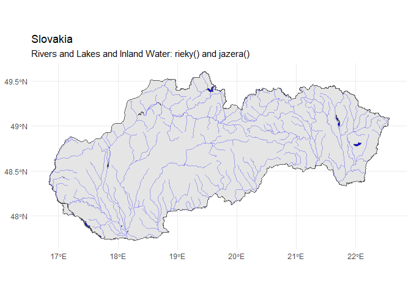
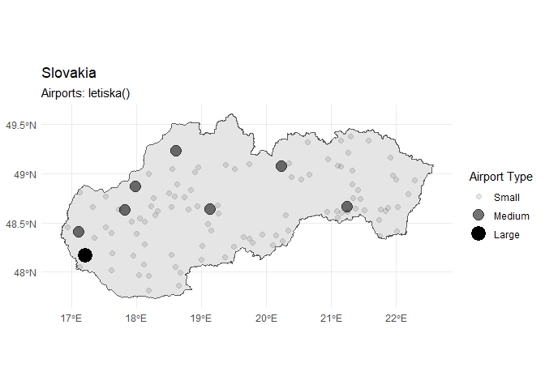

# RSlovakia

This is work in progress to download a set of shapefiles relevant to
Slovakia. It was inspired by the popular
[RCzechia](https://github.com/jlacko/RCzechia) package for Czech
Republic datasets which was in turn inspired by the
[tigris](https://github.com/walkerke/tigris) package.

## The following points of interest are currently included:

  - Borders
  - Regions
  - Counties
  - Waterways (Rivers and
Lakes)
  - Roads
  - Railroads
  - Airports

#### Planning to add the following points of interest during development:

  - Population and demographics
  - Physical geography such as elevation, forests, etc.
  - Points of interest such as parks, churches, schools, government
    buildings, etc.
  - Development, education, health, transport, etc. indicators

## Demo of current functionality

Here is a walkthrough of the current functionality of the package.

### Borders (Hranice)

<!-- -->

### Regions (Kraje)

<!-- -->

### Counties (Okresy)

<!-- -->

### Roads (Cesty)

<!-- -->

### Railroads (Zeleznice)

<!-- -->

### Rivers and Lakes and Inland Water (Rieky)

<!-- -->

### Points of Interest - Airports (Letiska)

<!-- -->
