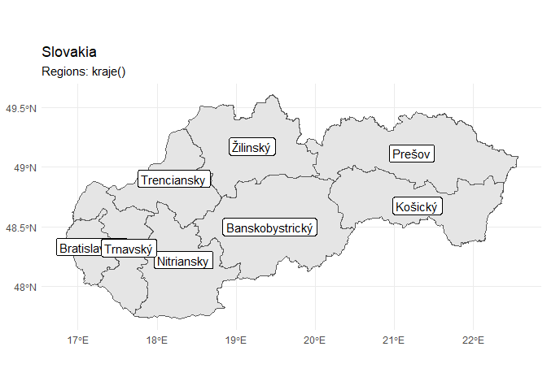

# RSlovakia

This is work in progress to download a set of shapefiles relevant to
Slovakia. It was inspired by the popular
[RCzechia](https://github.com/jlacko/RCzechia) package for Czech
Republic datasets which was in turn inspired by the
[tigris](https://github.com/walkerke/tigris) package.

## The following spatial objects are planned to be included:

  - Borders of Slovakia \[DONE\]
  - Regions of Slovakia \[DONE\]
  - Counties of Slovakia \[DONE\]
  - Municipalities of Slovakia
  - City parts of cities with defined parts in Slovakia
  - Waterways of Slovakia
  - Roads of Slovakia \[DONE\]
  - Railroads of Slovakia \[DONE\]
  - Protected natural areas of Slovakia
  - Forests of Slovakia
  - Terrain of Slovakia

## Demo of current functionality

Here is a walkthrough of the current functionality of the package.

### Borders (Hranice)

<!-- -->

### Regions (Kraje)

<!-- -->

### Counties (Okresy)

<!-- -->

### Roads (Cesty)

<!-- -->

### Railroads (Zeleznice)

<!-- -->

Currently, all of the data is being downloaded and transformed from
[diva-gis.org](http://www.diva-gis.org/gdata).
